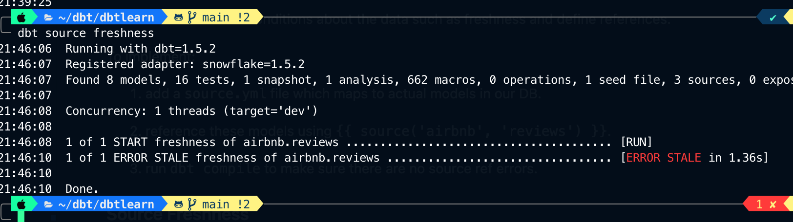

# AllThingsdbt

## VSCode Extensions

1. dbt Power User

    Activated by editing settings.json with file association definition.

    ```JSON
    "files.associations": {
        "*.sql" : "jinja-sql"
    },
    ```

## Project Intro

Manage a simple dbt project using Airbnb data + dbt + Snowflake. Create a standard/enterprise data flow and leverage dbt plus extensions to deliver a well documented dbt project.

* 3 sources come directly from AirBnb

1. `RAW_HOSTS`
2. `RAW_LISTINGS`
3. `RAW_REVIEWS`

* 1 source comes from "external" side - full moons data as csv.

1. `seed_full_moon_dates.csv`

### Data Flow

RAW --> SRC(SOURCE) --> DIM/FACT --> MART -->  DASHBOARD/BI TOOL

#### Raw Layer

* Represents the raw data from AirBnB that was brought into Snowflake from an S3 Bucket - `AIRBNB.RAW`

#### Staging Layer

* Represented by SRC(SOURCE) models. The purpose of this layer is to take RAW sources and apply column or data type formatting to create
a `SRC_` model for DIM and MART models.

* Ambiguous column names like "name" and "id" are changed to reference their source "listing_name", "listing_id".
* Materialized as `view` since our sources won't be accessed that frequent.

#### Core Layer

* Represented by DIM/FCT tables.
* `dim_listings_cleansed.sql` + `dim_hosts_cleansed.sql` = `dim_listings_with_hosts.sql`
* `fct_reviews.sql`
* Model dependency plays a big role in Core Layer when executing `dbt build` (compilation) and `dbt run` (execution).
* Usage of `{{ ref('src_listings') }}` defines the Parent/Child relationship for dbt docs and dbt Power User.
* Materialized as `table` since Core Layer models will be accessed quite often.

#### More about [ref Jinja function](https://docs.getdbt.com/reference/dbt-jinja-functions/ref)

```text
First, it is interpolating the schema into your model file to allow you to change your deployment schema via configuration. Second, it is using these references between models to automatically build the dependency graph. 
```

#### More about `fct_reviews` model

This model will update only when new reviews are added to our source - this prevents this fact table from rebuilding every time `dbt run` runs. [More info here](https://docs.getdbt.com/docs/build/incremental-models)

So, to add the sql logic that states "only add new or updated records that have been created since last dbt run" we use:

```sql

  AND review_date > (select max(review_date) from {{ this }})

```

plus a hashed surrogate key in our model:

```sql
{{ dbt_utils.generate_surrogate_key(['listing_id', 'review_date', 'reviewer_name', 'review_text']) }}
    AS review_id,
```

#### More about ephemeral models

We've converted our `src_` models to be materialized as ephemeral models which basically does NOT bring them into the database and keeps the sql as a CTE.

```yml
src:
      # ephemeral models are not directly built into the database.
      # Instead, dbt will interpolate the code from this model into dependent models as a CTE.
      # see target/ directory for compiled sql
      +materialized: ephemeral
```

Note: model might need to be dropped explicitly from DB if they were already materialized.

We can view the compiled sql for any model in our `target/` directory.

### Target Directory

* Path `dbtlearn/target/run/dbtlearn/models/dim/dim_listings_clean.sql`

Here you can find the final compiled sql which can help debug as well as the CTE for our ephemeral materialized models:

```sql
WITH  __dbt__cte__src_listings as (
WITH raw_listings AS (
    SELECT
        *
    FROM
        AIRBNB.raw.raw_listings
)
```

## Seeds and Sources

Our `source.yml` file serves as an abstraction layer on-top of our input data for dbt.

We can check various conditions about the data such as freshness and define references.

To implement:

1. add a `source.yml` file which maps to actual models in our DB.

2. reference these models using `{{ source('airbnb', 'reviews') }}`.

3. run `dbt compile` to make sure there are no source ref errors.

### Source Freshness

Source freshness is checked using a build in dbt function and run command.

1. Define what column in what table to look for "freshness".

In the raw reviews table look at the `date` column and see if any values break the freshness rules defined.

```yml

- name: reviews
        identifier: raw_reviews
        loaded_at_field: date
        freshness:
          warn_after: { count: 1, period: hour }
          error_after: { count: 24, period: hour }

```

2. run `dbt source freshness`



## Tests

Run with `dbt test` or `dbt test --select <model>`

1. Singular Tests

    SQL queries stored in `tests/` which are expected to return an empty result set.
2. Generic Test

    * unique
    * not_null
    * accepted_values
    * Relationships

3. dbt packages

### Implementing Generic Tests

Tests are added to our `Model/` directory via the `schema.yml` file. You can execute these test using the `dbt test` command.

We can see the compiled SQL in the `target/compiled/dbtlearn/tests` directory.

### Implementing Singular Tests

These tests live in the `tests/` directory as SQL files.

For example `dim_listings_minimum_nights.sql` checks that there are no minimum nights less than 1. Why? because logically you cannot stay at an AirBnb for less than 1 day.

```sql
SELECT
    *
FROM
    {{ ref('dim_listings_clean') }}
WHERE minimum_nights < 1
LIMIT 10
```

**Remember, these test should return an empty result set!!!**

### Debugging Test

What to do when a test fails? Debug with compiled SQL.

```terminal
cat target/compiled/dbtlearn/models/schema.yml/accepted_values_dim_listings_c_710e2a5c95c641691752d7222ba68f46.sql
```

## Macros, Custom Tests and Packages

* Macros are Jinja templates created in the Macros folder.
* The special `test` macro can help you implement generic tests.

To create your own test macro, we first create our macro using Jinja:

```jinja

    SELECT * FROM {{ model }} WHERE
    
        {{ col.column }} IS NULL OR
    
    FALSE

```

Next, we implement the test macro, see `test/no_nulls_in_dim_listings.sql`:

```sql
{{ no_nulls_in_columns(ref('dim_listings_clean')) }}
```

### Custom Generic Tests

"A macro with a special signature, called in our yml files."

Here we created a generic test using a macro. Which checks that the given column from model contains positive values.

```jinja


SELECT
    *
FROM
    {{ model }}
WHERE
    {{ column_name}} < 1

```

To implement this macro we referenced it in our `schema.yml` file:

```yml
- name: minimum_nights
        description: '{{ doc("dim_listing_clean__minimum_nights") }}'
        tests:
          - positive_value
```

The `(model, column_name)` is what makes this generic. We can add this test to any column in our `schema.yml` file and the `(model, column_name)` will be filled in automatically. Again here, we are returning the rows that break this test in our WHERE clause.

## Installing 3rd Party Packages

[dbt package hub](https://hub.getdbt.com/)

Two step installation:

1. add package to `packages.yml`
2. run `dbt deps`

An example of using `dbt-utils` is creating a primary key. In our `fct_reviews.sql` file we added:

```sql
SELECT 
  {{ dbt_utils.generate_surrogate_key(['listing_id', 'review_date', 'reviewer_name', 'review_text']) }}
    AS review_id,
```

It is common to have to do a full refresh using `dbt run --full-refresh --select <model>` in order to avoid `on_schema_change=fail` errors.

## Documentation

### Writing and Exploring Documentation

Documentation can be added to various `yml` files such as:

* `schema.yml`
* `sources.yml`
* `tests`

The documentation property is most often called `description` and is added like this:

```yml
models:
  - name: dim_listings_clean
    description: Cleansed table which contains Airbnb listings.
```

Once you've added documentation, you generate using `dbt docs generate` and to serve via lightweight server we use `dbt docs serve`.

### Creating your own docs.md

We created our own docs.md file for `minimum_nights` and reference the doc key when applying this documentation to our `.yml` files.

```markdown

Minimum number of nights required to rent this property.

Keep in mind that old listings might have `minimum_nights` set
to 0 in the source tables. Our cleansing algorithm updates this to `1`.



```

```yml
- name: minimum_nights
        description: '{{ doc("dim_listing_clean__minimum_nights") }}'
        tests:
          - positive_value

```

### Viewing your Data Flow DAG

You can only view your Lineage Graph - Data Flow DAG IF you have references between models. Otherwise you will only see standalone models.

## Analyses

SQL queries that don't produce models but can still leverage all of the dbt tools available like macros and packages.

You can view the compiled sql by running `dbt compile` and then navigating to the `target/compile` directory.

## Great Expectations Overview

[Official Doc](https://github.com/calogica/dbt-expectations)

Implementation occurs in our `schema.yml` file:

```yml
  - name: dim_listings_w_hosts
    tests:
      - dbt_expectations.expect_table_row_count_to_equal_other_table:
          compare_model: source('airbnb', 'listings')
```


Quantile Checks:

```yml
- name: dim_listings_w_hosts
    tests:
      - dbt_expectations.expect_table_row_count_to_equal_other_table:
          compare_model: source('airbnb', 'listings')
    columns:
      - name: price
        tests:
          - dbt_expectations.expect_column_quantile_values_to_be_between:
              quantile: .95
              min_value: 50 # (Optional)
              max_value: 500 # (Optional)

```

Testing Sources:

We first add the test to our `sources.yml` 

```yml
sources:
  - name: airbnb
    schema: raw
    tables:
      - name: listings
        identifier: raw_listings
        columns:
          - name: room_type
            tests:
              - dbt_expectations.expect_column_distinct_count_to_equal:
                  value: 4
```

To execute, we use the `source:` tag:

```terminal
dbt test --select source:airbnb.listings
```
